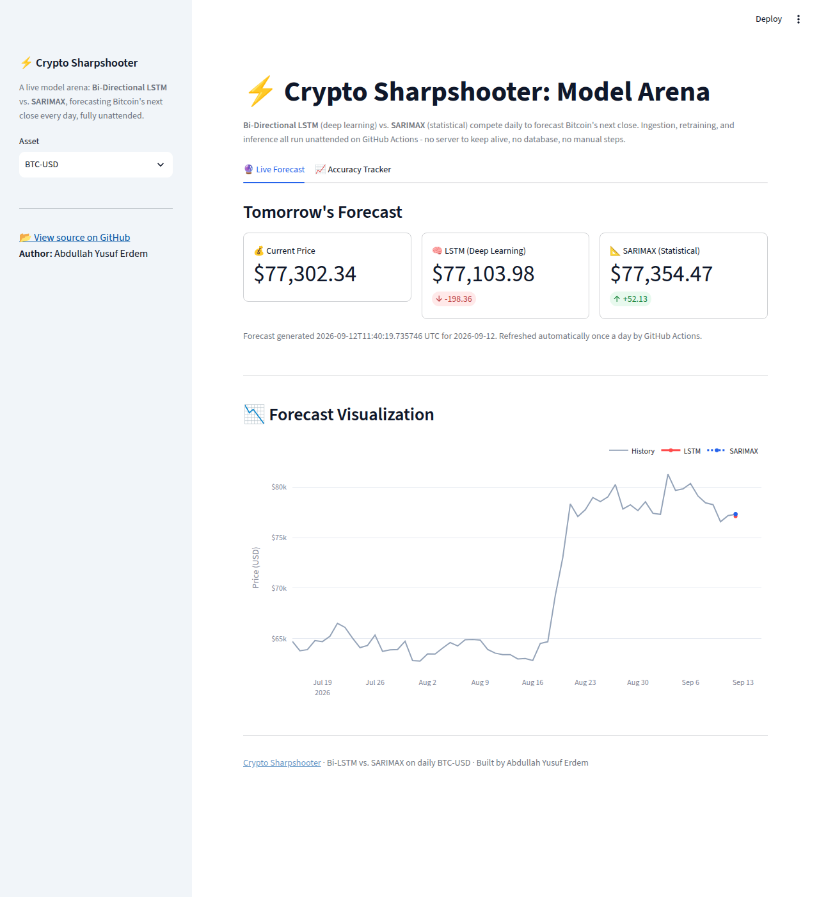
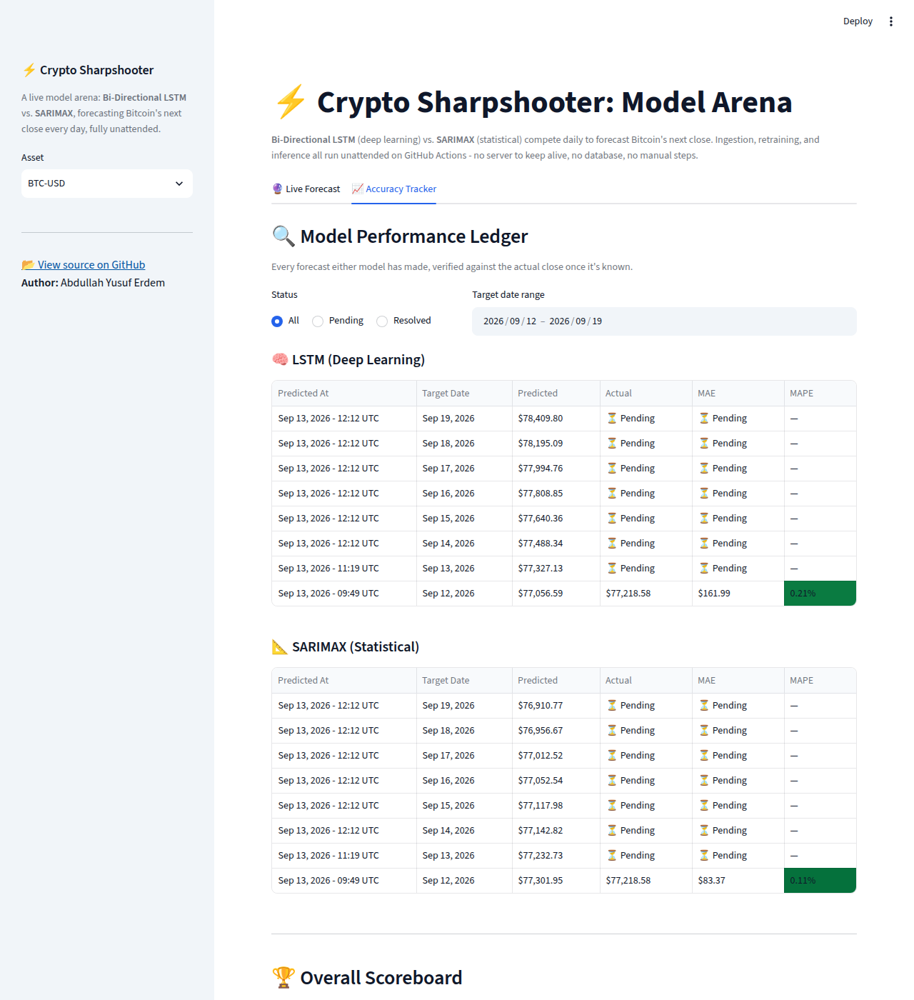

# 📈 Crypto Price Predictor  
### End-to-End Machine Learning System for Daily Bitcoin Price Forecasting


A full-stack, production-grade ML system that forecasts Bitcoin prices using a **live model arena** where **Bi-Directional LSTM** and **SARIMAX** compete daily.  
The system automates data ingestion, feature engineering, training, evaluation, storage, and prediction serving.

👉 **Live Demo:** *https://btcforecaster.streamlit.app/*  
👉 **Author:** *Abdullah Yusuf Erdem*

---

## 📸 Dashboard Preview

**Live Forecast** — current price, tomorrow's LSTM vs. SARIMAX prediction, and a chart of recent history plus both forecasts:



**Accuracy Tracker** — every past prediction, its actual outcome once known, and running MAE/MAPE per model:



*(Both captured straight off the live pipeline's own output right after its first automated run - not mockups.)*

---

## 🧠 Project Overview

This project goes *far beyond* a Jupyter Notebook.  
It is a **fully automated, serverless MLOps system** that runs indefinitely for free with zero manual steps:

- Ingests daily real-time Bitcoin price data via GitHub Actions  
- Engineers stationarity-friendly features  
- Retrains LSTM + SARIMAX on the updated history every day  
- Produces a fresh next-day price forecast every day, from that day's model  
- Tracks and evaluates prediction accuracy over time  
- Commits every result straight back to the repo as the system of record  
- Displays forecasts and metrics on a Streamlit dashboard that auto-redeploys on every update  

Perfect for showcasing **Data Engineering**, **ML Engineering**, and **MLOps** skills.

---

## ⭐ Key Features

### 🔀 Dual-Engine Forecasting  
Two competing forecasting models:
- **Bi-Directional LSTM (Deep Learning)**
- **SARIMAX (Statistical Time Series)**

The system identifies the best daily signal.

### 🤖 Automated MLOps Pipeline
One GitHub Actions cron, once a day:
1. Ingest new data
2. Validate yesterday's forecast now that the actual close is known (MAE / MAPE)
3. Retrain both models on the updated history
4. Overwrite the model artifacts
5. Forecast tomorrow's close with the freshly retrained model

Retraining daily means every forecast is a plain one-step-ahead prediction
from a model that has already seen today's close - never a multi-day
recursive rollout, so error doesn't compound across a horizon.

### 🗄️ File-Based Data Store
- No database to host, pay for, or lose network access to
- Price history and predictions live as version-controlled CSV/JSON files under `data/`
- Every GitHub Actions run commits its output straight back to the repo, which is also what triggers the dashboard to auto-redeploy with fresh numbers

### 📐 Stationarity Engineering  
Mitigates ML’s extrapolation issues via:
- Log Returns  
- RSI  
- Bollinger Band Position  
- Lag Features  
- Scaling & sequence generation  

### 🧩 Architecture  
- **Automation:** GitHub Actions (one daily scheduled cron: ingest, retrain, forecast)  
- **Frontend:** Streamlit (reads committed files directly - no backend to run)  
- **Training:** LSTM + SARIMAX  
- **Storage:** Versioned CSV/JSON files in the repo (`data/`, `models/`)  

---

## 🏗️ System Architecture  

```mermaid
flowchart LR
    A[CoinGecko Public API] -->|Daily Ingest| B[data/*.csv in repo]
    B -->|Daily Retrain| F{Retrain Pipeline}
    F -->|Train LSTM| G[Bi-Directional LSTM]
    F -->|Train SARIMAX| H[SARIMAX]
    G & H -->|Load| C[Bi-LSTM + SARIMAX Inference]
    C -->|Forecast Tomorrow| D[data/predictions.json]
    D -->|git commit + push| E[GitHub repo]
    G & H -->|git commit + push| I[models/*.keras + *.pkl]
    E -->|auto-redeploy on push| J[Streamlit Dashboard]
````

Nothing in this pipeline needs a network-reachable server: GitHub Actions runs on GitHub's own infrastructure (full internet access, unlike a laptop behind NAT/Docker), writes its output as files, and pushes them to the repo. Streamlit Community Cloud auto-redeploys on every push, so the dashboard always reflects the latest committed data with zero manual steps and zero database to keep alive.

---

## 📊 Results & Findings

### **Backtests & Live Forward-Testing**

| Model        | Type                | MAE         | Insight                                                              |
| ------------ | ------------------- | ----------- | -------------------------------------------------------------------- |
| **SARIMAX**  | Statistical         | **~$1,608** | ⭐ **Winner** — crypto daily prices are mean-reverting and efficient. |
| **Bi-LSTM**  | Deep Learning       | ~$1,639     | Good at trend direction but struggled with volatility.               |
| **Baseline** | Naive (Random Walk) | ~$1,595     | Hard to beat a random-walk baseline in crypto.                       |

### 🧠 Conclusion

Daily crypto forecasting has low signal-to-noise.
Deep Learning finds patterns, but **statistical baselines remain strong competitors** on daily data.

The table above is a static offline backtest. The **Accuracy Tracker** tab on the [live dashboard](https://btcforecaster.streamlit.app/) is the ongoing, unmediated record - every real-world forecast either model has made, verified against what actually happened the next day, updated automatically every day.

---

## 🛠️ Installation & Setup

### **Prerequisites**

* Python 3.10+

No database and no Docker required - everything reads and writes plain files under `data/` and `models/`.

---

### 1️⃣ Clone the Repository

```bash
git clone https://github.com/yusuferdem16/CryptoCurrencyPricePredicter.git
cd CryptoCurrencyPricePredicter
```

### 2️⃣ Install Dependencies

```bash
python -m venv venv
source venv/bin/activate      # Windows: venv\Scripts\activate
pip install -r requirements-pipeline.txt   # everything, including model training
```

`requirements.txt` alone only covers what the dashboard needs (pandas, plotly, streamlit, matplotlib) - that's deliberate, see [Automation (Production)](#️-automation-production) below. `requirements-pipeline.txt` pulls that in plus the training/inference dependencies (requests, scikit-learn, statsmodels, pmdarima, tensorflow-cpu).

### 3️⃣ Run the Pipeline Locally

```bash
python -m src.automation   # daily job: ingest, verify, retrain, forecast tomorrow
```

This command is idempotent and safe to re-run; it reads/writes the CSV/JSON files under `data/` and the model artifacts under `models/`.

---

## 🚀 Usage

### ▶️ Start the Dashboard

```bash
streamlit run src/dashboard.py
```

Access: **[http://localhost:8501](http://localhost:8501)**

The dashboard reads `data/*.csv` and `data/predictions.json` directly - it does not call any backend or database.

---

## ⚙️ Automation (Production)

One GitHub Actions workflow drives the live deployment, no manual steps required:

| Workflow | Schedule | What it does |
| --- | --- | --- |
| `.github/workflows/daily_prediction.yml` | Daily, 05:00 UTC | Ingest latest price → verify yesterday's forecast → retrain LSTM + SARIMAX on the updated history → forecast tomorrow → commit `data/` and `models/` |

The workflow uses the default `GITHUB_TOKEN` (with `contents: write` permission declared in the workflow) to push its results back to the repo - **no secrets need to be configured**. It installs `requirements-pipeline.txt`. Every push to the repo also triggers Streamlit Community Cloud to auto-redeploy the dashboard with the latest data - it installs the root `requirements.txt`, which is deliberately kept to just what the dashboard imports, since Community Cloud's free tier has a 1GB RAM ceiling that installing TensorFlow/pmdarima/statsmodels for an app that never imports them could blow past.

---

## 📂 Project Structure

```
CryptoCurrencyPricePredicter/
├── data/                      # Price history + predictions (committed by CI)
│   ├── raw_btc_usd.csv
│   ├── features_btc_usd.csv
│   └── predictions.json
├── models/                    # Saved .keras and .pkl artifacts (committed by CI)
├── docs/screenshots/          # Dashboard screenshots used in this README
├── src/
│   ├── automation.py          # Daily job: ingest, verify, retrain both models, forecast tomorrow
│   ├── dashboard.py           # Streamlit UI (reads data/ directly)
│   ├── data_processing.py     # Scaling + sequence generation
│   ├── storage.py             # File-based data store (CSV/JSON)
│   ├── feature_engineering.py # RSI, MACD, Bollinger
│   ├── ingestion.py           # CoinGecko public API data fetcher
│   ├── sarimax_pipeline.py    # SARIMAX trainer
│   ├── train.py               # LSTM trainer
│   ├── baseline.py            # Naive random-walk baseline for comparison
│   ├── eda.py                 # Exploratory data analysis
│   ├── force_run.py           # Manual/local trigger for the daily job
│   └── models/                # Model definitions
├── .streamlit/                # Streamlit theme/config
├── .github/workflows/
│   └── daily_prediction.yml
└── requirements.txt
```

---

## 🛡️ License

This project is licensed under the **MIT License**.

---

## 👤 Author

**A. Yusuf Erdem**
Final Year Capstone Project | ML Engineering | MLOps | Data Science

Feel free to reach out for discussion, collaboration, or feedback!
